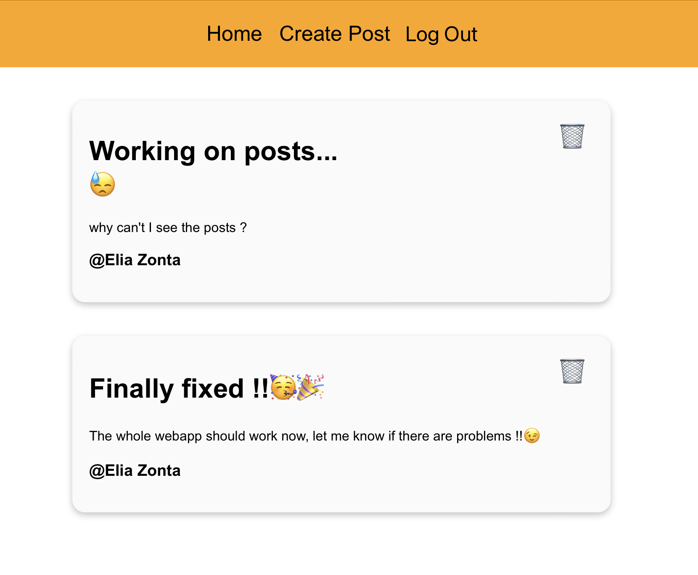

# "Blog" webapp with React + Firebase 🔥

View [here]( https://eliazonta.github.io/blog/)

This is a blog [React](https://reactjs.org) webapp, uses [Firebase](https://firebase.google.com) to store users data and posts, you can visualize posts, and create or delete them only if you are logged in with Google 

## Preview

## Run the project locally
1. clone the repo
2. open the terminal and navigate to che cloned directory
3. run `npm i firebase`
4. run `npm start`

